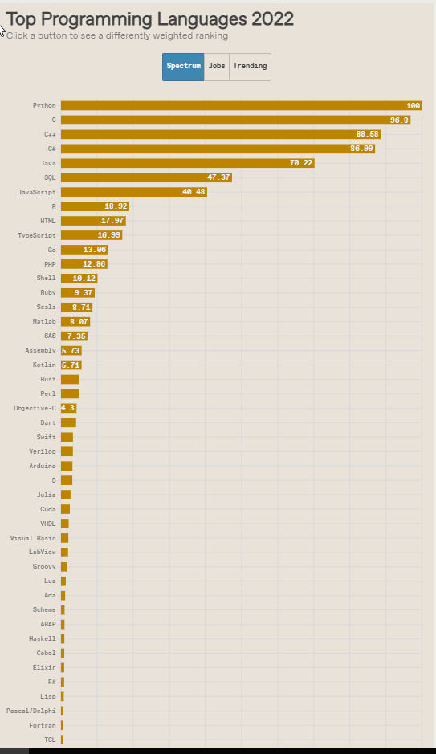
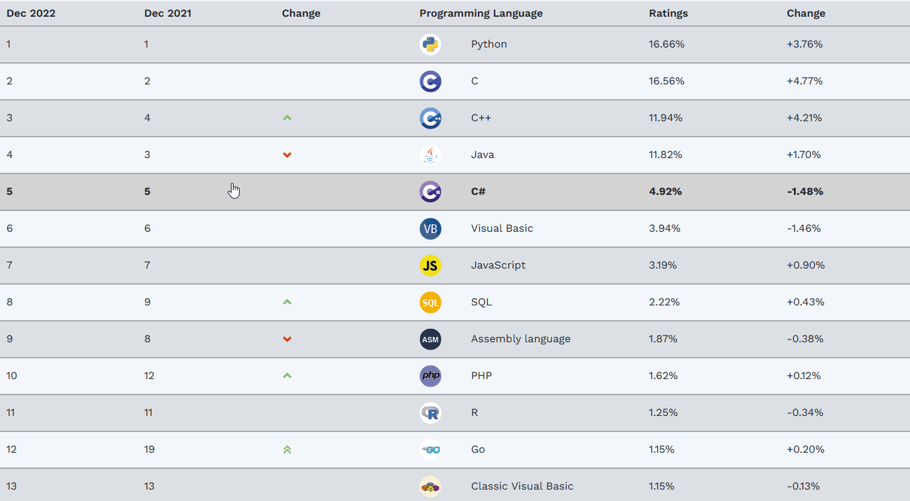
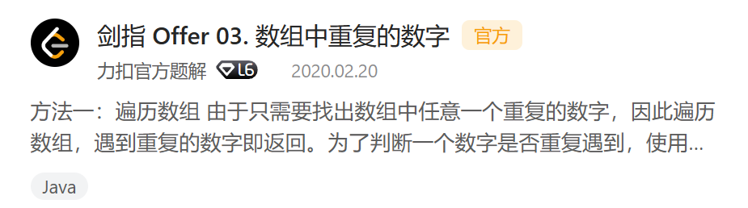

# 编程语言流行程度爬虫工作
该部分负责人：李雨哲
## 完成的工作
- &nbsp;&nbsp;&nbsp;&nbsp;爬取了IEEE Spectrum上2022年编程语言的流行程度, [网页链接](https://spectrum.ieee.org/top-programming-languages-2022)。对57种编程语言从`spectrum`, `jobs`, `trending`三方面分别打分。  
  &nbsp;&nbsp;&nbsp;&nbsp;网页部分数据图片：

- &nbsp;&nbsp;&nbsp;&nbsp;爬取了TIOBE（一个专门统计编程语言流行程度的网站）上的数据，[网页连接](https://www.tiobe.com/tiobe-index/)。该网站对前20名和后30名编程语言做了统计。
- &nbsp;&nbsp;&nbsp;&nbsp;网页部分数据图片：
- &nbsp;&nbsp;&nbsp;&nbsp;爬取了Leetcode上`剑指Offer2`题目单上所有题目的所有题解的语言标签。  
  &nbsp;&nbsp;&nbsp;&nbsp; Leetcode算是国内甚至国外计算机学生找工作必刷的网站，支持多种语言提交。其中不同语言的提交数量很能反应人们习惯使用哪种语言，对编程语言的流行程度分析很有作用。而且不同于前两个数据源是爬取别人已经统计好的数据，只有一个页面而且是综合了很多方面的结果。这次的数据是需要自己创建的，需要爬取大量的页面，因此这部分数据更具有原创性和针对性，对应面临找工作的学生，哪种编程语言更流行。  
  &nbsp;&nbsp;&nbsp;&nbsp;选择`剑指Offer2`的题单出于以下三个方面的考虑：面试基本必刷的题目，极具代表性；题目数量适当，少的话不具有普遍性，多的话爬取时间过长；题单里的题目没有VIP专享，数据都是公开的，符合爬虫伦理。  
  &nbsp;&nbsp;&nbsp;&nbsp;题解的语言标签示例如下：

## 使用方式
&nbsp;&nbsp;&nbsp;&nbsp;在`IEEE`,`Leetcode`,`TIOBE`三个文件夹中都有`data.csv`，是最终数据爬取的结果，可以直接在此基础上使用，无需再运行`Crawler.py`。

## 温馨提示
&nbsp;&nbsp;&nbsp;&nbsp;IEEE，TIOBE的数据量较少，爬取很快，Leetcode涉及的网页，数据很多，爬取一次的时间较长，测试下来接近40分钟。如果需要重新爬取所有数据请耐心等待。